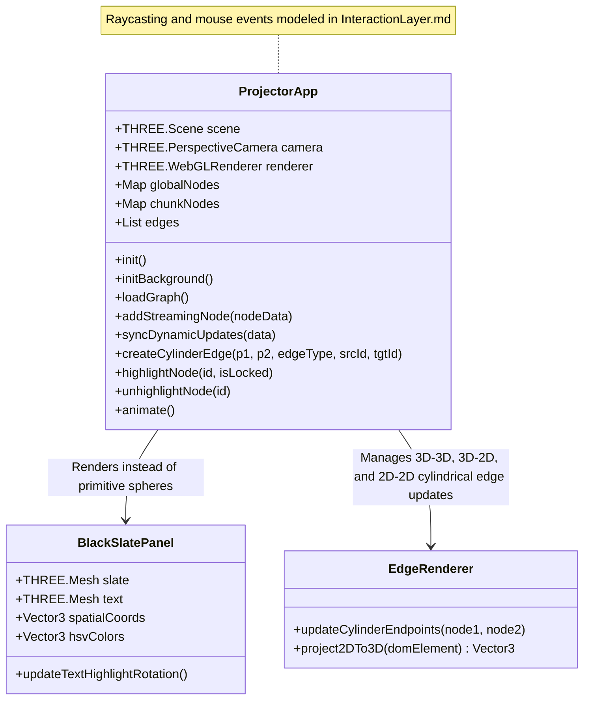
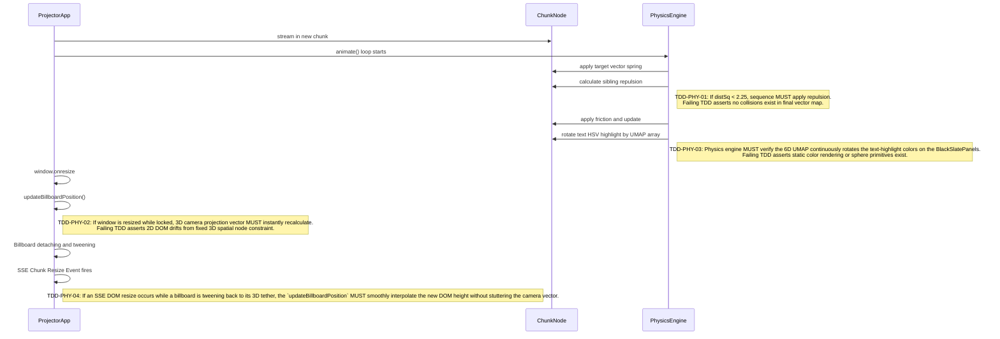

# 3D Projector

This module manages the physical Three.js coordinate mapping, topology rendering, and normalization physics located in `projector.js`.

## Object Model



## Algorithmic Pseudocode (from `projector.js`)

```javascript
// From projector.js: animate()
function applyNormalizationPhysics(chunkPanels) {
    // Prevent erratic jumping when new nodes are streamed in
    
    for (let i = 0; i < chunkPanels.length; i++) {
        let panel = chunkPanels[i];
        
        // Continuously rotate HSV highlight colors on the text mesh
        panel.updateTextHighlightRotation();

        if (!panel.userData.targetPos || !panel.userData.velocity) continue;
        
        let t = panel.userData.targetPos;
        let v = panel.userData.velocity;
        
        // 1. Spring force towards Kuzu-calculated target coordinates
        v.x += (t.x - panel.position.x) * 0.05;
        v.y += (t.y - panel.position.y) * 0.05;
        v.z += (t.z - panel.position.z) * 0.05;
        
        // 2. Repel from sibling chunks sharing the same parent
        for (let j = 0; j < chunkPanels.length; j++) {
            if (i === j) continue;
            let other = chunkPanels[j];
            if (panel.userData.parent_id === other.userData.parent_id) {
                let dx = panel.position.x - other.position.x;
                let dy = panel.position.y - other.position.y;
                let dz = panel.position.z - other.position.z;
                let distSq = dx*dx + dy*dy + dz*dz;
                
                if (distSq > 0.01 && distSq < 2.25) { // Inside repulsion radius
                    let dist = Math.sqrt(distSq);
                    let force = (1.5 - dist) / dist; 
                    v.x += dx * force * 0.05;
                    v.y += dy * force * 0.05;
                    v.z += dz * force * 0.05;
                }
            }
        }
        
        // 3. Apply friction, clamp max velocity (TDD-PHY-05), & update position
        v.multiplyScalar(0.85);
        v.clampLength(0, 0.5); // Prevent UMAP manifold explosion
        panel.position.add(v);
    }
}
```

## Function Design & TDD Assertions


