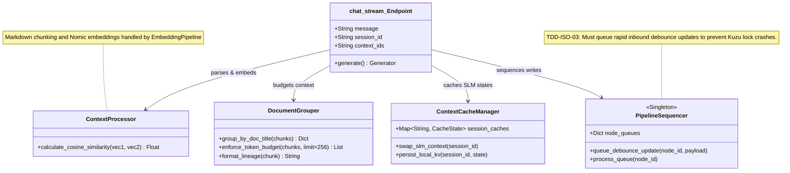

# Context Engine

This module (primarily inside `app.py`) handles token budgeting, semantic chunk ranking, and structural lineage injection before generating LLM responses via the `/api/chat/stream` endpoint.

## Object Model



## Algorithmic Pseudocode (from `app.py`)

```python
# From app.py: chat_stream()
def build_prompt_with_context(message, context_ids):
    # 1. Gather all queried chunks via references (@) and retrieves (\)
    all_chunks = []
    for cid in context_ids:
        if is_global(cid):
            all_chunks.extend(fetch_chunks_for_global(cid))
        else:
            all_chunks.extend(fetch_specific_chunk(cid))
            
    # 2. Sort by semantic relevance (Cosine Similarity)
    target_vec = embed_texts([message])[0]
    for chunk in all_chunks:
        chunk['score'] = cosine_sim(target_vec, chunk['emb'])
    all_chunks.sort(key=lambda x: x['score'], reverse=True)
    
    # 3. Enforce Token Budget
    doc_groups = {}
    current_tokens = 0
    for c in all_chunks:
        tokens = len(c["content"].split()) * 1.3
        if current_tokens + tokens > 256:
            break
        title = c["doc_title"]
        if title not in doc_groups: doc_groups[title] = []
        doc_groups[title].append(c)
        current_tokens += tokens
        
    # 4. Inject Structural Lineage (Group by document and prepend headers)
    context_text = ""
    for title, chunks_list in doc_groups.items():
        context_text += f"\n--- From Document: {title} ---\n"
        for c in chunks_list:
            if c["lineage"]: context_text += f"{c['lineage']}\n"
            context_text += f"{c['content']}\n"
            
    return context_text
```
