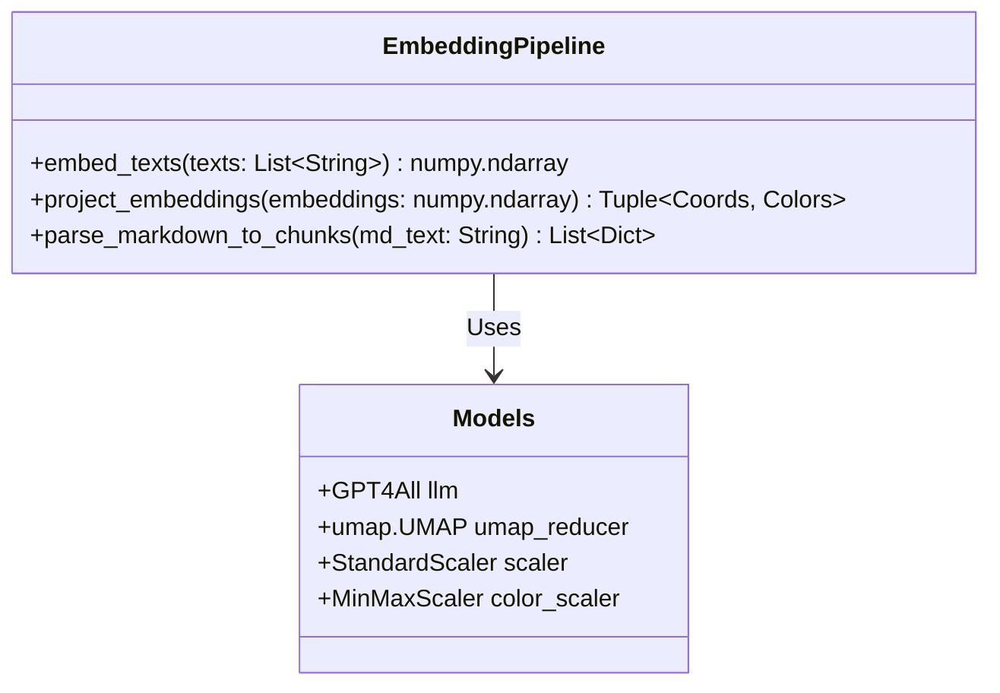
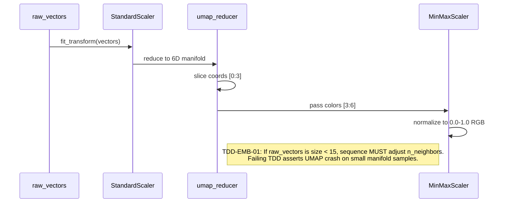

# Embedding Pipeline

This module isolates the heavy data-science operations within `app.py`. It handles the parsing of raw markdown into recursive chunk ASTs, local text embeddings via Nomic, and dimensionality reduction via UMAP for 3D spatial mapping.

## Object Model



## Algorithmic Pseudocode (from `app.py`)

```python
def parse_markdown_to_chunks(md_text):
    # 1. Split text into lines and maintain a header stack
    chunks = []
    current_lines = []
    header_stack = {}
    
    # 2. Identify line types
    def get_line_type(text):
        if re.match(r'^(#{1,6})\s', text): return 'heading'
        if text.startswith('- '): return 'list'
        if '|' in text and '-' in text: return 'table'
        return 'paragraph'
        
    # 3. Push chunks dynamically while preserving structural lineage
    def push_chunk():
        if current_lines:
            content = '\n'.join(current_lines)
            lineage = "\n".join(header_stack[lvl] for lvl in sorted(header_stack.keys()))
            chunks.append({"type": current_chunk_type, "content": content, "lineage": lineage})
    
    return chunks

def project_embeddings(embeddings):
    # 1. Scale input vectors for consistent manifold learning
    emb_scaled = scaler.transform(embeddings)
    
    # 2. Reduce to 6 dimensions (3 for space, 3 for color)
    proj = umap_reducer.transform(emb_scaled)
    
    # 3. Extract coordinates
    coords = proj[:, 0:3]
    
    # 4. Extract and normalize colors (RGB 0.0 - 1.0)
    colors_raw = proj[:, 3:6]
    colors = color_scaler.fit_transform(colors_raw)
    
    return coords, colors
```

## Function Design & TDD Assertions


