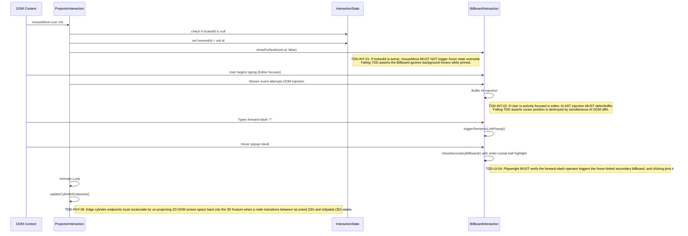

# Interaction Layer

This module formally maps the event-driven bridge between the 3D WebGL context (`ProjectorApp`) and the 2D DOM context (`BillboardApp`). It manages the state machine for hovering, locking, dragging, and detaching the UI from the 3D space.

## Object Model

```mermaid
classDiagram
    class InteractionState {
        <<Singleton / Global>>
        +String hoveredId
        +String lockedId
        +Boolean isDragging
        +Boolean isDetached
    }

    class ProjectorInteraction {
        +getIntersects(event)
        +onMouseMove(event)
        +onClick(event)
        +onDoubleClick(event) // Spawns new global node
        +unlockNode()
        +updateBillboardPosition()
    }

    class BillboardInteraction {
        +initDrag()
        +showForNode(id, locked)
        +hide()
        +flyToView()
        +returnToTether()
        +setPosition(x, y)
        +triggerSemanticLinkPopup() // " / " operator
        +showSecondaryBillboard(refId)
    }

    ProjectorInteraction --> InteractionState : Updates hover/lock
    BillboardInteraction --> InteractionState : Updates drag/detach
    ProjectorInteraction --> BillboardInteraction : Triggers show/hide/position
    BillboardInteraction --> ProjectorInteraction : Requests unlock
```



## Algorithmic Pseudocode (Bridge Logic)

```javascript
// projector.js: onMouseMove
function handleHoverEvent(event) {
    if (InteractionState.lockedId) {
        // If locked, we only update position, we do not change hover state
        updateBillboardPosition();
        return;
    }

    let intersects = getIntersects(event);
    if (intersects.length > 0) {
        let id = intersects[0].object.userData.id;
        if (InteractionState.hoveredId !== id) {
            InteractionState.hoveredId = id;
            window.billboardApp.showForNode(id, false);
        }
    } else {
        InteractionState.hoveredId = null;
        window.billboardApp.hide();
    }
}

// billboard.js: contextmenu
function handleRightClick(event) {
    event.preventDefault();
    if (InteractionState.isDetached) {
        // First right click: Break fly-to-view and return to 3D node coordinates
        // Renders as a distant chat panel while tethered to its spatial topology
        returnToTether();
    } else {
        // Second right click (or if already tethered): Close entirely
        window.app.unlockNode();
    }
}

// billboard.js: onKeyPress
function handleSlashOperator(event) {
    if (event.key === '/') {
        triggerSemanticLinkPopup();
    }
}
```

## Function Design & TDD Assertions


