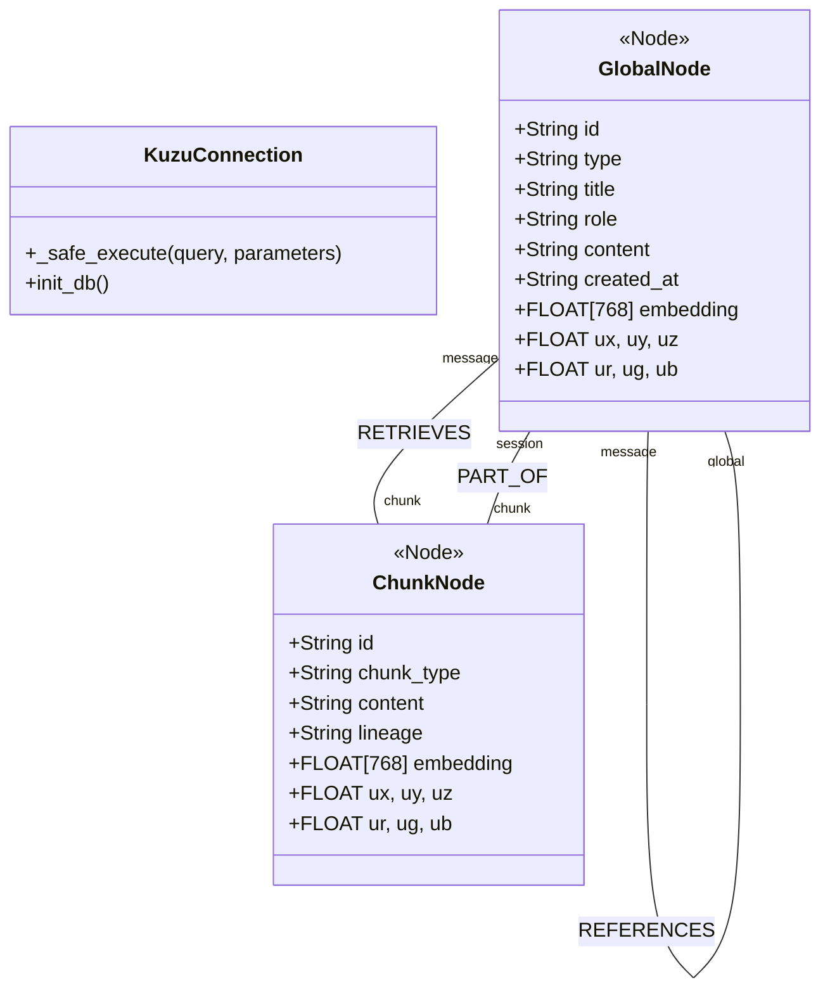
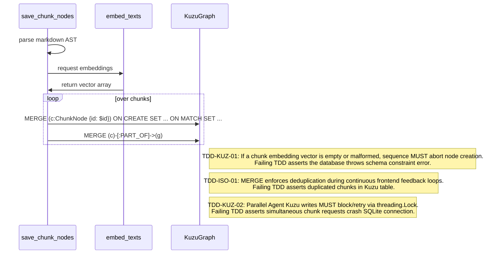

# Kuzu Graph Database

This module defines the vector-graph persistence layer (`app.py`), capturing conversational state, relational embeddings, and hierarchical markdown structures.

## Object Model



## Algorithmic Pseudocode (from `app.py`)

```python
# From app.py: update_node() and chat_stream()
def save_chunk_nodes(session_id, markdown_content):
    # 1. Parse markdown recursively into AST chunks
    chunks = parse_markdown_to_chunks(markdown_content)
    
    if not chunks:
        return []
        
    texts = [c['content'] for c in chunks]
    embs = embed_texts(texts)
    
    # 2. Iterate and create Chunks
    sum_emb = np.zeros(768)
    for i, c in enumerate(chunks):
        c_id = f"chunk_{uuid.uuid4().hex[:8]}"
        c_emb = embs[i]
        sum_emb += c_emb
        
        # 3. Create Cypher for Node
        query = f"""
            CREATE (c:ChunkNode {{
                id: $id, chunk_type: $type, content: $content, 
                lineage: $lineage, embedding: $emb, 
                ux: $ux, uy: $uy, uz: $uz, ur: $ur, ug: $ug, ub: $ub
            }})
        """
        conn.execute(query, params)
        
        # 4. Bind structurally to the base session node
        edge_query = f"MATCH (c:ChunkNode {{id: '{c_id}'}}), (g:GlobalNode {{id: '{session_id}'}}) CREATE (c)-[:PART_OF]->(g)"
        conn.execute(edge_query)
        
    # 5. Average the global node embedding based on the sum of chunks
    avg_emb = sum_emb / len(chunks)
    conn.execute(
        f"MATCH (g:GlobalNode) WHERE g.id = '{session_id}' SET g.embedding = $emb", 
        {"emb": avg_emb.tolist()}
    )
```

## Function Design & TDD Assertions


