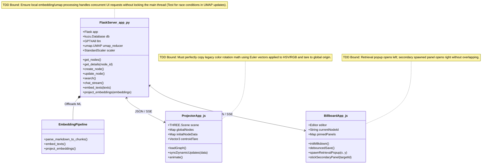
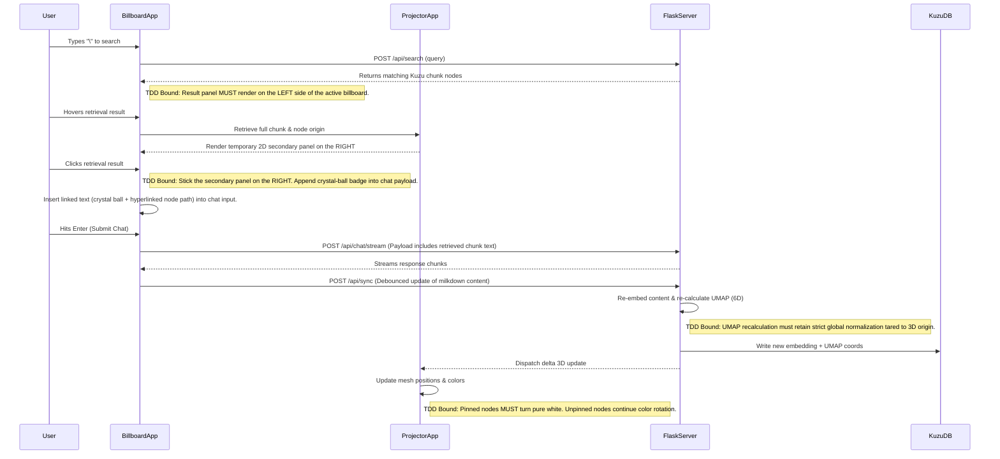

# System Object Model (MAIN)

This diagram serves as the primary frame of complete reference for the overall architecture of the Solvolos 3D Milkdown App. It identifies the high-level modules, their exact class/function mappings, and establishes the explicit sequence flows and TDD bounds for integration.

**Important:** Please see [REQUIREMENTS.md](./REQUIREMENTS.md) for the 17 verbatim statements of objective facts detailing the mandatory UX and system activity behavior.

## 1. High-Level Object Model

## 2. Sequence Diagram & TDD Bounds

## 3. User Activities

1. **Empty Background Node Generation**: Double-clicking the empty 3D background creates a milkdown billboard panel (no primitive spheres), 'stuck' in place, which follows the user's viewport pan as they navigate.
2. **Pinned Node Color State**: When a node is clicked and stuck to the 2D UI, its text color immediately changes to pure white, overriding any UMAP color rotation.
3. **Instant Markdown Rendering**: Dragging the pinned billboard and typing yields instant rendering of recursive tree-structured markdown (nested lists, enumeration, tables) as the user types.
4. **Adaptive Chat Independent Interface**: The AI chat panel docks independently below the scrollable milkdown editor, dynamically growing downward on input and collapsing to exactly three lines when not hovered/typing.
5. **Debounced Embedded Sync Loop**: A debounce triggers the milkdown payload -> quantized embedder -> KuzuDB -> delta UMAP projector -> Kuzu -> 3D UI update, preserving global tare and legacy color rotation mechanics.
6. **Semantic Link Search & Placement**: A forward-slash (`/`) operator triggers a scrollable pop-up of chunk results to the *left* of the billboard. Hovering results spawns a temporary 2D secondary panel on the *right*. Clicking it pins the secondary billboard, ensuring no UI interference.
7. **Verbose Chat Context**: Retrieved results insert their raw chunk text, highlighted in violet with a crystal ball emoji acting as a markdown hyperlink to the Kuzu graph, directly into the chat input payload for the SLM.

## 4. User Stories

- **US-1**: As a user, I want to double-click empty space in the 3D void to spawn a pinned 2D milkdown billboard panel with no 3D sphere, and see its text turn pure white while pinned.
- **US-2**: As a user, I want to type `\` during a chat to instantly see a popup of semantically related nodes on the left, hover to see a temporary preview on the right, and click to pin the preview and insert the chunk text with a crystal-ball link into my chat input.
- **US-3**: As a user, I want AI responses to intelligently place themselves under matching markdown headers, appending *after* my original text while maintaining strictly isomorphic subtrees of the original content.
- **US-4**: As a user, when I manually edit an AI-generated chunk in the billboard, my changes instantly trigger a debounce pipeline that syncs to KuzuDB and dynamically updates the 6D UMAP projector, retaining the global tare of the legacy tracker.
- **US-5**: As a user, I want to see unpinned nodes in the background constantly rotating their HSV colors and XYZ positions using the exact math and speed established in the legacy tracker.

## 5. 3D GUI Expected Experience

When the user launches the application, they are greeted by a deep, fog-filled 3D void representing the `KuzuDB` graph. Crucially, there are NO spheres. Floating within this void are black-slate panels where text is highlighted by 6D UMAP colors (3 spatial, 3 HSV). 
Unpinned nodes continuously rotate their colors and spatial orientations at the exact speed of the legacy tracker, explicitly copying its `applyMatrix4(colorMatrix)` and origin-tared coordinate normalizations.

If the user double-clicks empty space, a new 2D milkdown billboard spawns and locks to the viewport, turning its text pure white. If the user invokes retrieval via `\`, a semantic search panel opens strictly to the left. Hovering a search result previews its original source panel to the right, and clicking pins it there while injecting the verbose text directly into the chat input. The independent chat panel below adaptively grows and collapses. The user experience is entirely spatial, local, and fluid—there are no traditional pagination or tab-based UI paradigms.
