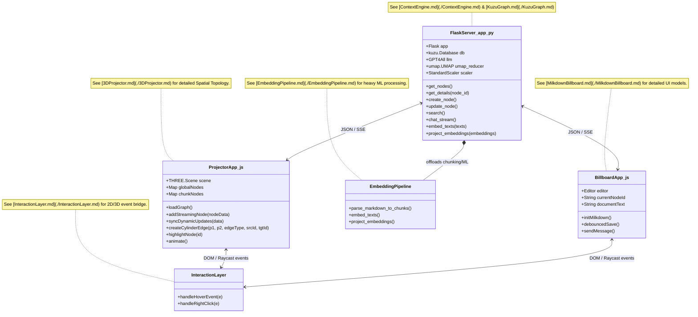

# System Object Model (MAIN)

This diagram serves as the primary frame of complete reference for the overall architecture of the Solvolos 3D Milkdown App. It identifies the high-level modules, their exact class/function mappings, and delegates the detailed UML models to specific module files.

**Important:** Please see [REQUIREMENTS.md](./REQUIREMENTS.md) for the 11 verbatim statements of objective facts detailing the mandatory UX and system activity behavior.

## User Activities
1. **Empty Background Node Generation**: Double-clicking the empty 3D background creates a milkdown billboard panel (no primitive spheres), 'stuck' in place, which follows the user's viewport pan as they navigate.
2. **Instant Markdown Rendering**: Dragging the pinned billboard and typing yields instant rendering of recursive tree-structured markdown (nested lists, enumeration, tables) as the user types.
3. **Adaptive Chat Independent Interface**: The AI chat panel docks independently below the scrollable milkdown editor, dynamically growing downward on input and collapsing to exactly three lines when not hovered/typing.
4. **Isomorphic Appends & Inline Diffs**: SLM responses append *after* the original user updates and diff-update inline. The recursive subtree fields of the original markdown MUST remain strictly isomorphic as subtrees to the updated semantically-composed tree post-diff DOM update. (No duplicates or diffeomorphisms allowed).
5. **Debounced Embedded Sync Loop**: A debounce triggers the milkdown payload (original markdown format) -> quantized embedder -> KuzuDB -> delta UMAP projector -> Kuzu -> 3D UI update.
6. **Semantic 6D Projector Mechanics**: Right-clicking flies the billboard back to its original 3D position while still rendering as a distant chat panel. The nodes are NOT spheres, but black-slate panels where embedded text highlights with 6D UMAP (3 spatial, 3 HSV) continuously rotating colors at the exact speed of the legacy tracker.
7. **Semantic Link Search**: A forward-slash (`/`) operator triggers a scrollable pop-up of chunk results above the billboard. Hovering results shows violet crystal-ball text and spawns a temporary 2D secondary panel. Clicking it pins the secondary billboard.

## User Stories
- **US-1**: As a user, I want to double-click empty space in the 3D void to spawn a pinned 2D milkdown billboard panel with no 3D sphere.
- **US-2**: As a user, I want to type `\` during a chat to instantly see a popup of semantically related nodes to link into my prompt, and hover over them to see a temporary secondary panel.
- **US-3**: As a user, I want AI responses to intelligently place themselves under matching markdown headers, appending *after* my original text while maintaining strictly isomorphic subtrees of the original content.
- **US-4**: As a user, when I manually edit an AI-generated chunk in the billboard, my changes instantly render nested lists and trigger a debounce pipeline that syncs to KuzuDB and the 6D UMAP projector.
- **US-5**: As a user, I can have multiple chat billboards open simultaneously, with adaptive chat panels that collapse to 3 lines when blurred, and the SLM flawlessly switches between their contexts.

## 3D GUI Expected Experience
When the user launches the application, they are greeted by a deep, fog-filled 3D void representing the `KuzuDB` graph. 
Crucially, there are NO spheres. Floating within this void are black-slate panels where text is highlighted by 6D UMAP colors (3 spatial, 3 HSV) that rotate continuously at the exact speed of the legacy tracker.

If the user double-clicks empty space, a new 2D milkdown billboard spawns and locks to the viewport. If the user clicks and drags this billboard, they can type and instantly render rich markdown. The independent chat panel below adaptively grows and collapses to three lines. 
If the user right-clicks the void, the billboard flies back to its original 3D position while still rendering as a chat panel from a distance. The user experience is entirely spatial, local, and fluid—there are no traditional pagination or tab-based UI paradigms.
