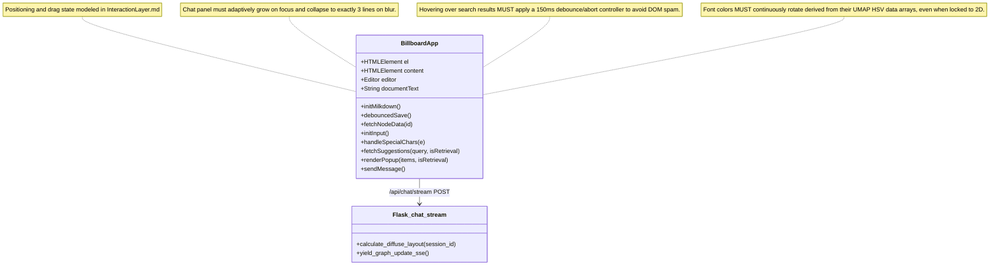
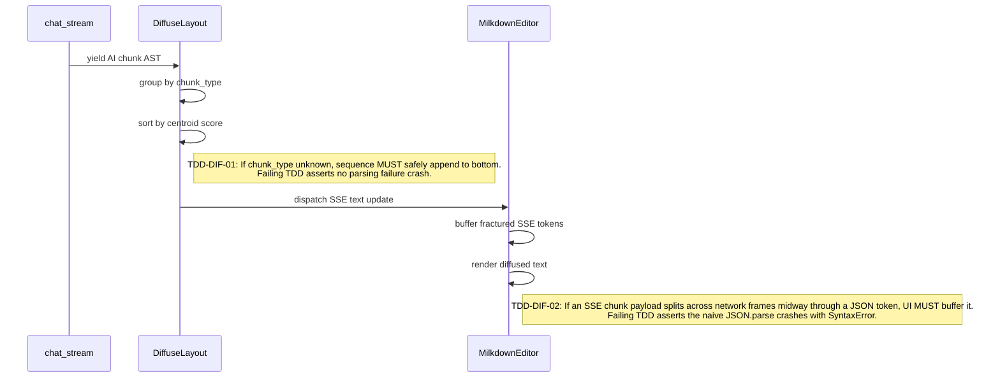
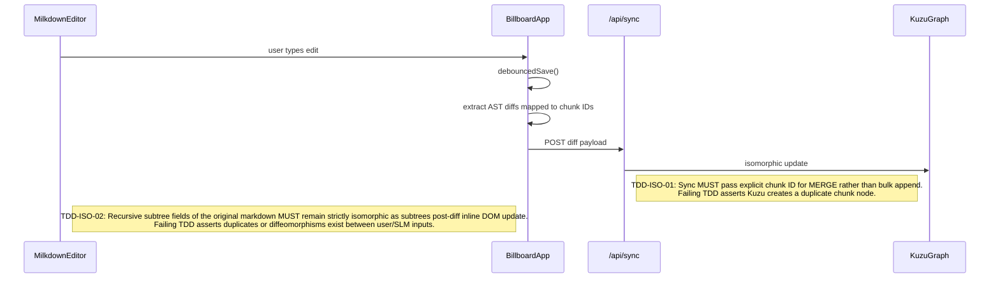

# Milkdown Billboard

This module manages the 2D brutalist UI (solid black, no rounding, no noisy close buttons/labels), prompt panel, and diffuse semantic rendering of AI responses over the existing document tree, implemented in `billboard.js` and `app.py`.

## Object Model



## Algorithmic Pseudocode (from `app.py`)

```python
# From app.py: chat_stream()
def calculate_diffuse_layout(all_session_chunks):
    # AI stream does not append linearly. 
    # We group by chunk_type and sort by similarity to the group centroid.
    
    type_groups = {}
    for sc in all_session_chunks:
        ctype = sc["type"]
        if ctype not in type_groups: type_groups[ctype] = []
        type_groups[ctype].append(sc)
        
    for ctype, items in type_groups.items():
        if not items: continue
        # 1. Calculate centroid for the semantic type
        centroid = np.mean([item["emb"] for item in items], axis=0)
        norm_centroid = np.linalg.norm(centroid)
        
        # 2. Score elements against centroid
        for item in items:
            norm_item = np.linalg.norm(item["emb"])
            item["score"] = np.dot(centroid, item["emb"]) / (norm_centroid * norm_item)
            
    # 3. Rebuild document text ordered by semantic hierarchy, not chronology
    type_order = ['heading', 'paragraph', 'list', 'code', 'table']
    sorted_types = sorted(type_groups.keys(), key=lambda k: type_order.index(k) if k in type_order else 99)
    
    diffuse_layout = {}
    diffused_parts = []
    
    for ctype in sorted_types:
        items = type_groups[ctype]
        items.sort(key=lambda x: x["score"], reverse=True)
        diffuse_layout[ctype] = [item["id"] for item in items]
        
        for item in items:
            diffused_parts.append(item["content"])
            
    diffused_content = "\n\n".join(diffused_parts)
    return diffused_content, diffuse_layout
```

## Function Design & TDD Assertions



## State Persistence: Diff-Sync Feedback Loop


