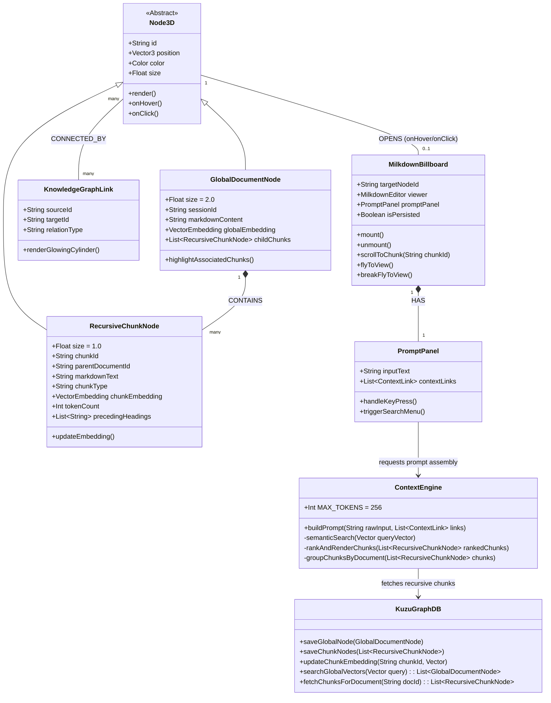

# Architecture Documentation

## 1. Overview
This application is a 3D-first knowledge and chat interface. The primary GUI is a Three.js-powered 3D projector that visualizes conversational nodes (Global Document Nodes and Recursive Chunk Nodes) and their relationships. Interacting with nodes opens localized 2D Milkdown-based billboards for viewing dynamically rendered markdown and continuing conversations. The backend relies on a Kuzu vector-graph database to store conversation history, explicit context links, and recursively chunked markdown structures for strict, token-limited semantic retrieval.

## 2. Core Components

### 2.1. Frontend: 3D Projector Layer (Three.js)
- Manages the visual graph of global chat/response nodes and their constituent recursive chunk nodes.
- Global document vector nodes are rendered twice as large as their corresponding recursive chunk nodes.
- Highlights semantic and conversational links using glowing cylinders, which serve specifically as knowledge graph links between 3D nodes.
- Projects 2D Milkdown billboards onto the screen based on the 3D coordinates of the selected node.
- **Hover & Interaction Mechanics**:
  - Hovering a chunk node reveals the full chat's billboard, scrolled to center the specific chunk.
  - Hovering a global node highlights it and its child chunk nodes, opening the billboard without a specific scroll focus.
  - Left-clicking the billboard "persists" it, flies it to full view, and makes the billboard completely draggable.
  - Right-clicking the billboard unsticks the invisible "fly-to-view-and-focus" link, sending it back to its 3D coordinates. Right-clicking again (or right-clicking an un-stuck billboard) closes it entirely, returning the system to the default show-when-hovered state.

### 2.2. Frontend: 2D Billboard Layer (Milkdown)
- **Recursive-Semantic Renderer**: Uses Milkdown billboards to dynamically render a recursive tree structure of semantic chunks. It does not display the user's raw prompt; instead, it renders an alien aggregation of AI responses organized by semantic similarity across the entire chat history.
- **Prompt Panel**: Persistent input area at the base of the billboard.
- **Intellisense-style Lookups**:
  - `/` or `\` (Search): Triggers a semantic vector search, returning ranked results of chunks in a popup. Selected queries turn into visual badges (🔮).

### 2.3. Context Engine
- Evaluates explicit links and semantic queries.
- Runs a full semantic search and ranking given the query vector with the global document vectors to locate relevant information.
- Iterates over ranked recursive-tree-chunk results until the context window limit (~256 tokens) is met. Orders the aggregated ranked chunks over their rendered markdown within their documents, such that the sections from each document are still clearly represented.
- Tracks preceding headings and subheadings that contain the chunk to maintain structural context during rendering.

### 2.4. Backend: Storage & Graph Layer (Kuzu DB)
- Stores nodes as full entities and as recursive tree chunks (e.g., individual paragraphs, code blocks) following the user's specific definitions of recursive markdown structures.
- Manages embeddings at two levels:
  - **Global**: The aggregated representation of a chat/response node.
  - **Recursive**: The representation of a specific markdown chunk.
- Maintains edge relationships: `FOLLOWS` (chat sequence), `REFERENCES` (explicit links), `PART_OF` (chunk to session).
- **Node Unification**: To prevent scattered projection drift, new chat messages do not spawn standalone global nodes. Instead, dynamic `ChunkNode`s are created and structurally bound to the base empty node (the session node) in the 3D space, mathematically clustered around the session's coordinate.

---

## 3. Object Model (UML)



## 4. Workflows

### 4.1. Projector Interaction (Hover & Persist)
1. User **hovers** over a `RecursiveChunkNode`.
2. A `MilkdownBillboard` mounts at the node's 3D position, initializing its scroll position to center the specific chunk.
3. User **left-clicks** the billboard. The `isPersisted` flag is set to true, the billboard flies into full central view, and it becomes fully draggable.
4. User **right-clicks** the billboard. The fly-to-view link breaks, and the billboard returns to its 3D coordinates in the distance.
5. User **right-clicks** again (or closes it). It closes and returns to standard hover mode.

### 4.2. Semantic Retrieval (`/` or `\`)
1. User types `/query text` or `\query text` in the prompt panel.
2. `ContextEngine` vectors the query and passes it to `KuzuGraphDB`.
3. Graph DB runs a full semantic search ranking the query vector against **global document vectors**.
4. The system retrieves the associated `RecursiveChunkNode`s and displays them in the mini-scrollable UI.
5. User selects a chunk; UI text converts to a visual badge `🔮 query text`.

### 4.3. Prompt Submission & Rendering Update
1. User presses Enter on the `PromptPanel`.
2. `ContextEngine` takes the raw text and attached context chunks and submits them to the local model as a regular chat stream.
3. The LLM streams its response back to the client.
4. **Diffuse Rendering Effect**: The UI does not append chronologically. Instead, it aggregates the new chunks into the unified semantic tree structure. New markdown fields are inserted right between old markdown fields based on their semantic similarity within their containment field types (`#`, `-`, `tables`, ```` `, etc.). This creates a living, evolving document unified over the full history of LLM responses.
